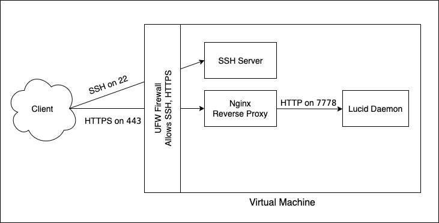

# LucidLink Interview Task

Setting up a VM running the lucid client.

The diagram below shows the high-level machine setup.



The plan for setting up the VM is shown below. The [scripts](#scripts) section contains instruction for a semi-automated setup using scripts.

## VM Setup

General VM setup tasks

### Create admin user

Creating an admin user so that we do not use `root`.

* Create a new user and make it admin

  ```bash
  useradd -U -G sudo -m -s /usr/bin/bash lucidadmin
  passwd lucidadmin
  ```

* Setup public SSH key so that the user can login via SSH using the private key.

  ```bash
  mkdir /home/lucidadmin/.ssh
  chmod 700 /home/lucidadmin/.ssh
  # place public key in /home/lucidadmin/.ssh/authorized_keys
  chmod 600 /home/lucidadmin/.ssh/authorized_keys
  chown -R lucidadmin:lucidadmin /home/lucidadmin/.ssh
  ```

* Confirm that you are able to login with the `lucidadmin` user using the SSH key.

### Secure SSH Login
https://www.cyberciti.biz/faq/how-to-disable-ssh-password-login-on-linux/

* Setup SSH config.

  ```
  /etc/ssh/sshd_config:
      PubkeyAuthentication yes
      PasswordAuthentication no
      ChallengeResponseAuthentication no
      UsePAM no
      PermitRootLogin no
  ```

* Make sure to check in `/etc/ssh/sshd_config.d/` for included config files and remove/edit as needed.
* Reload the `sshd` daemon

  ```bash
  systemctl reload sshd
  ```

### Setup Firewall 

Enable UFW and allow SSH connections.

```bash
ufw allow OpenSSH
ufw --force enable
```

## Lucid Daemon setup

Setup the lucid daemon as systemd service.

* Place the Lucid password in `/root/.lucidpass` and make sure only `root` has access.
  
  ```bash
  chown root:root /root/.lucidpass
  chmod 600 /root/.lucidpass
  ```
* Create systemd [unit file](./scripts/assets/lucid.service)  
* Place it in `/etc/systemd/system/lucid.service`
* Enable and start the service

  ```bash
  systemctl daemon-reload
  systemctl enable lucid.service
  systemctl start lucid.service
  ```

## Secure the REST API

Setup NGINX as reverse proxy forwarding traffic to the lucid app.

Will need to have SSL certificates. Example [certificate](/scripts/assets/lucidssl.crt) and its [private key](/scripts/assets/lucidssl.key).

* Place the certificate in `/etc/ssl/certs/`
* Place the private key in `/etc/ssl/private/`

### Install NGINX

```bash
apt-get update
apt-get install -y nginx
```

### Setup NGINX

* Remove the default Nginx site
  
  ```bash
  rm /etc/nginx/sites-enable/default
  ```

* Create Nginx [config file](./scripts/assets/lucidapi.conf)
  * Configure listener on port 443 with SSL certificate.
  * Configure the listener tp point to the lucid app.
* Place the file in `/etc/nginx/sites-available/lucidapi.conf`
* Create a symlink in `/etc/nginx/sites-enabled/` that points to the configuration.

  ```bash
  ln -s /etc/nginx/sites-available/lucidapi.conf /etc/nginx/sites-enabled/lucidapi.conf
  ```

* Reload Nginx

  ```bash
  systemctl reload nginx
  ```

* Allow port 443 on the firewall

```bash
ufw allow https
ufw reload
```

## Scripts

There are several scripts located in the [`scripts` directory](/scripts/) that allow for semi-automated configuration. It is assumed that they are executed as `root` or using sudo. To use them:

* Copy the `scripts` directory to the VM.

  ```bash
  scp -r ./scripts root@<HOST>:/tmp/.
  ```

* Login to the host with the `root` user and go to the copied directory.

  ```bash
  ssh root@<HOST>
  cd /tmp/scripts
  ```

* Execute the scripts in the following order
  
  * Create the admin user. To create the user with default login `lucidadmin` run:
 
    ```bash
    USER_PASS='<password>' ./create-admin-user.sh
    ```

    Confirm that you are able to login with the password and SSH key.

  * Secure the VM.
  
    ```bash
    ./secure-vm.sh
    ```
  
  * Setup the Lucid service

    ```bash
    LUCID_PASS='<password>' ./install-lucid-service.sh
    ```

  * Expose Lucid REST API over HTTPS by setting up Nginx as reverse proxy.

    ```bash
    ./setup-reverse-proxy.sh
    ```